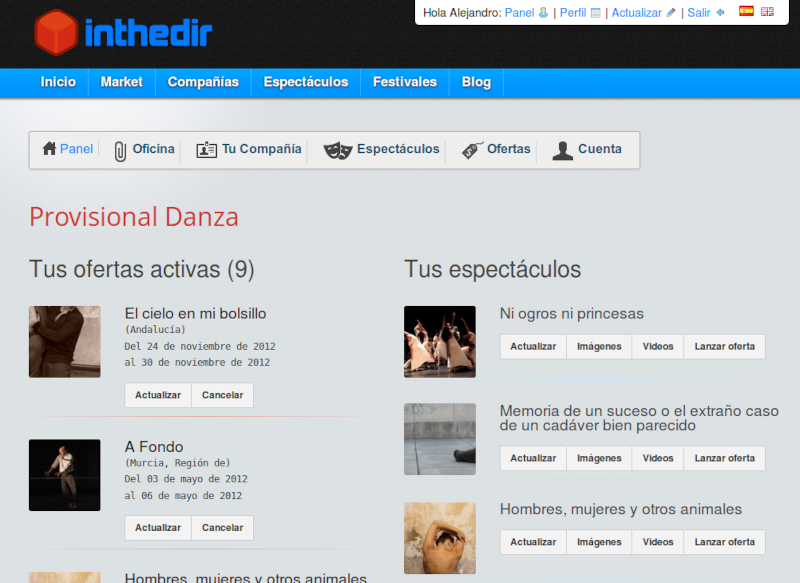
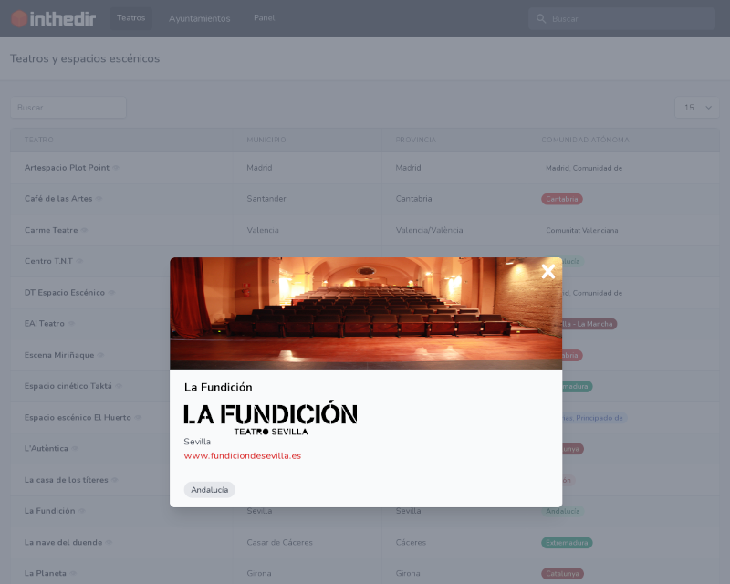

# Inthedir
Directorio teatral

Un proyecto personal para crear un directorio de artes escénicas.

El proyecto original, creado en 2010 con el framework Codeigniter, ofrecía una plataforma para gestionar la contratación de espectáculos entre gestores culturales y productoras/compañías.

El proyecto actual se desarrolla con Laravel y comienza como una base de datos pública de espacios y programaciones teatrales.

Para mí es una oportunidad para seguir aprendiendo con Laravel, Livewire, Vue.js, Tailwind CSS y otras herramientas.